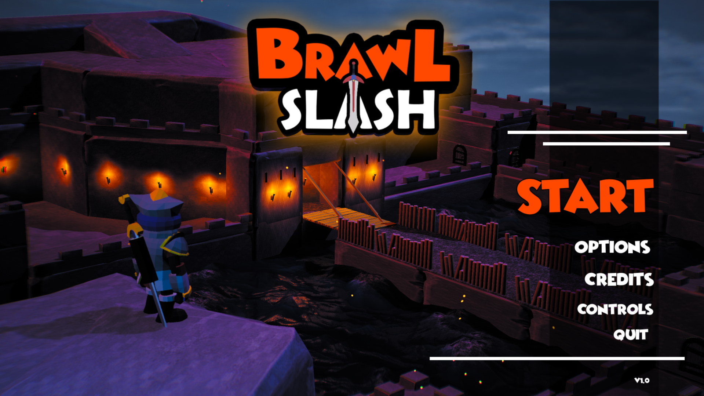
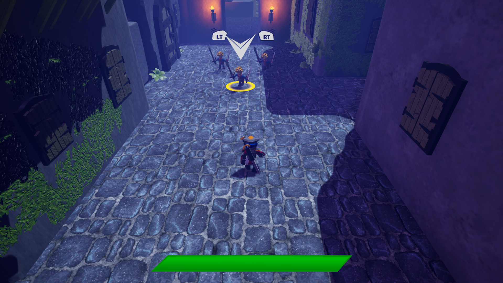
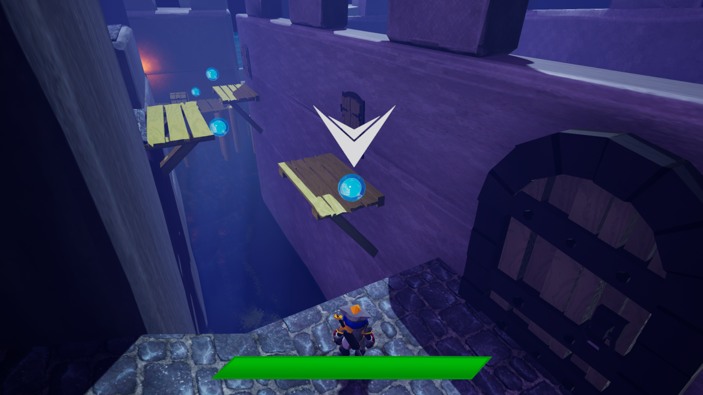

#BrawlSlash
Brawler 3D made with Game Programmer and Game Designer students using Unreal Engine | 4 Months

The project has been developed as a school assignment of [ISART Digital](https://www.isart.fr/) the project is then theirs and the authors property. We do not proclaim property over any of the assets we use on the project except the scripts.

___

___
Here are the students who worked on this project
| Name | Role|
|:---:|:---:|
| DELALONDE Yoan | Game Designer
| GINOYER Rémy | Game Designer
| GUILLOME Romain | Game Designer
| DEPREZ Nicolas | Game Programmer
| TODOROV Anatole | Game Programmer

#Screenshots

#Techs

The project has been developed under Unreal Engine 4.24

#How to Build

Launch the [.uproject](BrawlSlash.uproject) then build the solution.